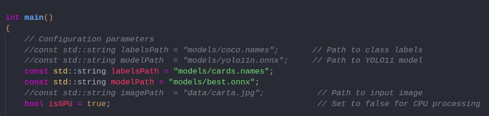
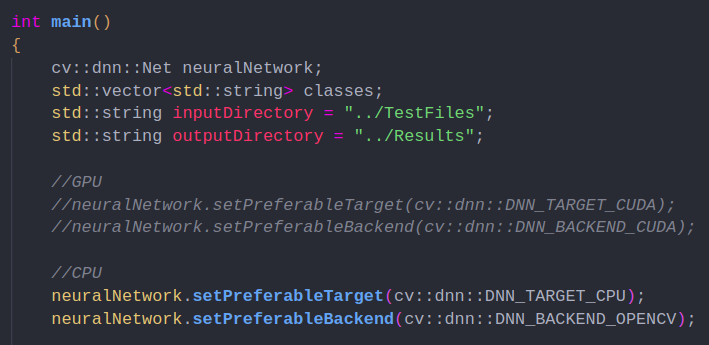

# **Práctica 4 - Parte 1**

### **Integrantes**

* Henry Tacuri
* Franklin GUapisaca

**Para ejecutar la parte 1A realizamos lo siguiente:**
* Nos ubicamos en la ruta del proyecto **YOLOs-CPP** en una terminal.
* Abrir el proyecto en un entorno de preferencia.
* Configurar la librería onnx runtime.
* Ajustar el archivo **Makefile** con los paths correspondientes.
* Para ejecutar con GPU ponemos la variable **isGPU** en true y para ejecutar con CPU ponemos la variable **isGPU** en false.



* Ejecutar el comando ```make```.
* Ejecutar el archivo **vision.bin** con el comando ```./vision.bin```.

**Para ejecutar la parte 1B realizamos lo siguiente:**
* Abrimos el proyecto **Object_Detection_MobileNetV3_OpenCV** en el entorno de preferencia.
* Nos ubicamos en el subdirectorio **ObjectDetection** en una terminal.
* Ajustar el archivo **Makefile** con los paths correspondientes.
* Para ejecutar con GPU o con CPU realizamos los cambios correspondientes en el archivo **ObjectDetection.cpp**, los cambios que se deben de realizar se detallan en la imagen.



* Ejecutar el comando ```make```.
* Ejecutar el archivo **vision.bin** con el comando ```./vision.bin```.